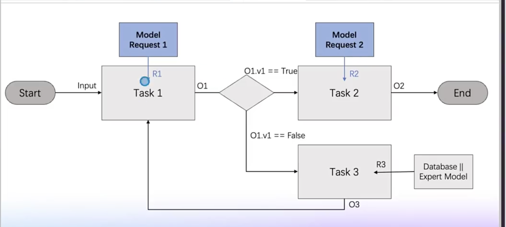
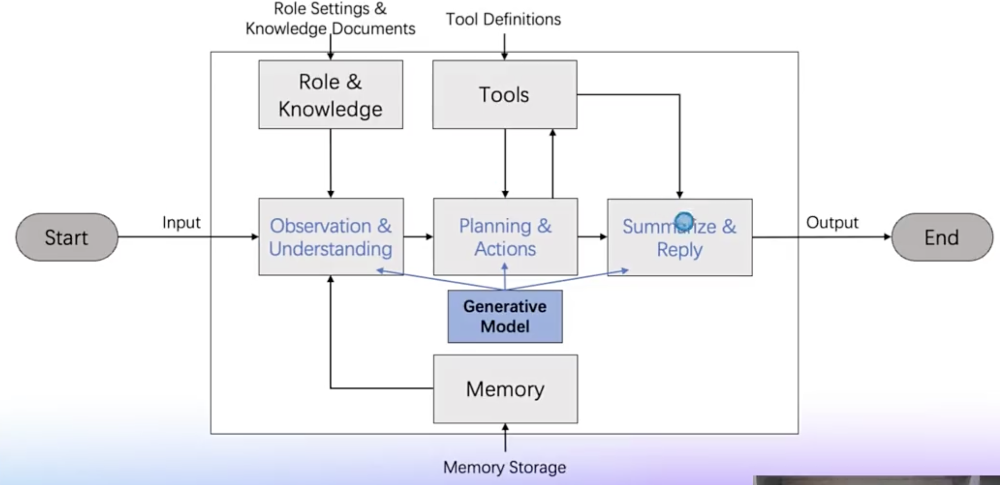

### ❓ 哪些因素会影响大模型应用的效果？

模型能力（智力）
通识理解和泛化能力
输入信息理解、推理、规划能力
输入信息补充知识学习能力
文字生成创作的风格
相关信息（知识）
与任务相关的信息
与互动背景相关的信息
模型输出控制（行动方法）
单次请求控制
Prompt表达优化
以CoT为代表的思维链控制方法
输出格式控制（文本格式语法、工程结构化数据输出…）
多次请求控制
以ReAct（Action-Observation-Reflection）为代表的多轮自我反思优化
复杂任务的执行过程编排管理
### 单次请求的局限性

上下文窗口长度限制、输出长度限制（早期的LangChain长文本Summarize）
直接进行CoT控制（尤其是用自然语言表达CoT）会输出思考过程，但我们不希望用户看到这个过程
随着工作进展出现的新信息，对任务时序、编排有依赖的信息，不一定能在单次请求中一次性完成输入
## 工作流的优势

将工作任务拆分成多个工作节点
能够将模型单次请求调用视作一个工作节点
能够灵活将其他代码逻辑也写入工作节点
能够对工作节点进行任务编排
能够在工作节点之间进行数据传递
### 智能体与工作流的区别

任务流程有输入输出，存在模型请求和条件判断，有循环，下面二张图是工程流还是智能体呢

 
 
 

第一张是工作流，第二张是智能体

## 工作流的特点:
    

以完成特定任务为目标，基于任务流程进行编排规划，重视业务流程和直接产品；

工作流程中使用了模型，模型输出结果只是过程中的一个数据结果，以业务逻辑为导向；

智能体，并解释工作流和智能体的特点

## 智能体的特点:
    

尝试构建解决问题的原方法，完成泛化任务，更重视任务处理的原方法的合理性，追求自身结构合理性
## 工作流和智能体的关系
    

工作流和智能体不是完全对立的状态，工作流可以包含智能体，智能体也可以被视作一种工作流

一个工作人员可以使用多个智能体，多智能体框架在寻找配合的原方法，在业务工作中可构建新逻辑链解决问题